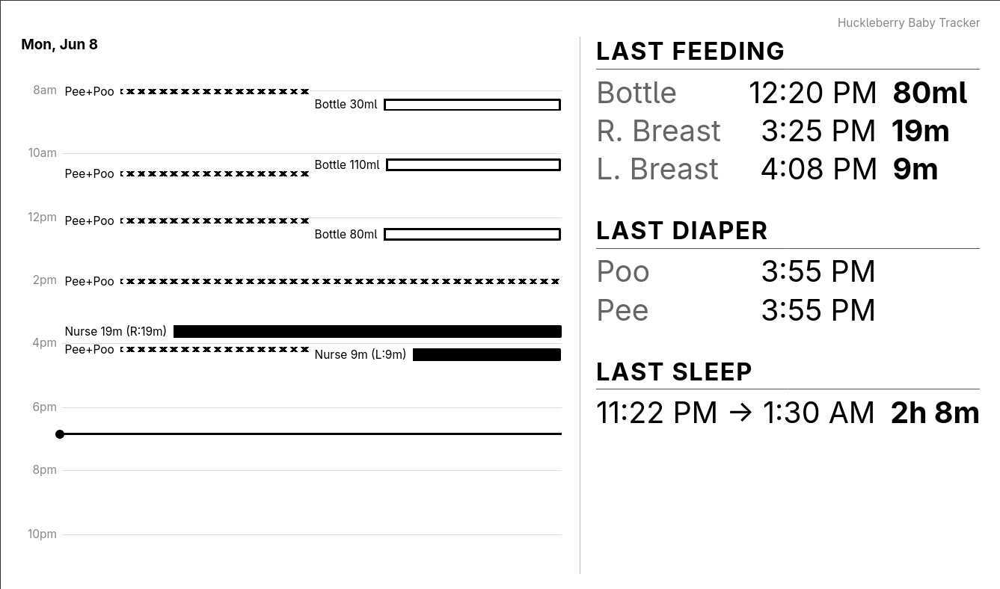

# trmnl-huckleberry

A persistent service that automatically fetches data from your [Huckleberry](https://huckleberrycare.com) baby tracking account and pushes it to your [TRMNL](https://trmnl.com) e-ink display. Huckleberry data is fetched using the unofficial [py-huckleberry-api](https://github.com/Woyken/py-huckleberry-api) python library.

No public URL or port forwarding is required.

## What it shows

The output is optimized for the [TRMNL (OG)](https://shop.trmnl.com/collections/devices/products/trmnl) and it's 2-bit 800×480 screen. Info is split into two panels: a visual event timeline on the left and a list of last feedings, diaper changes, and sleep events on the right.

Events are received from Huckleberry in effectively real time and the rate they can be pushed to TRMNL is configurable via `PUSH_INTERVAL_SECS` and is [capped](https://docs.trmnl.com/go/private-plugins/webhooks#rate-limits) at 12 times an hour.




**Left — Event timeline**

A chronological calendar of today's events. Before noon, shows from 9:00 PM the previous evening until noon current day. After noon, shows from 7:00 AM onward same day. Shows feeding, diaper change, and sleep events,

**Right — Last events**

- **Last Feeding** — most recent left nurse, right nurse, and bottle, each with time and detail
- **Last Diaper** — most recent poo and most recent pee tracked separately
- **Last Sleep** — start time, end time, and total duration

## Getting started

To use this plugin you need to create a private plugin using (requires the [BYOD license](https://shop.trmnl.com/products/byod)) and to host a docker container that can reach TRMNL's servers via the internet.

### 1. Create a TRMNL plugin

1. Go to [trmnl.com/plugin_settings?keyname=private_plugin](https://trmnl.com/plugin_settings?keyname=private_plugin) and add a new Private Plugin.
2. Set the strategy to **Webhook** and save.
3. Copy the **Webhook URL** that appears — you'll need it in the next step.
4. Click **Edit Markup**, copy the contents of [`template.html`](template.html) into the editor, and click **Save Changes**.

### 2. Configure and run

Edit `docker-compose.yml` and fill in your credentials directly:

```yaml
services:
  trmnl-huckleberry:
    image: ghcr.io/srwareham/trmnl-huckleberry:latest
    ports:
      - "8080:8080"
    environment:
      HUCKLEBERRY_EMAIL: you@example.com
      HUCKLEBERRY_PASSWORD: yourpassword
      TRMNL_WEBHOOK_URL: https://trmnl.com/api/custom_plugins/YOUR_PLUGIN_UUID
      TIMEZONE: America/Los_Angeles
    restart: unless-stopped
```

Then start it:

```sh
docker compose up -d
```

That's it. The service will push your Huckleberry data to TRMNL immediately and then every 15 minutes by default. Your display will update on its next wake cycle and the new plugin is added into your playlist by default.

---

## Configuration reference

Required and optional configurations can be set using environment variables in the docker compose file:

| Variable | Required | Default | Description |
|---|---|---|---|
| `HUCKLEBERRY_EMAIL` | Yes | — | Huckleberry account email |
| `HUCKLEBERRY_PASSWORD` | Yes | — | Huckleberry account password |
| `TRMNL_WEBHOOK_URL` | Yes | — | Webhook URL from your TRMNL plugin settings |
| `TIMEZONE` | No | `America/Los_Angeles` | Timezone for display (e.g. `America/Chicago`) |
| `HUCKLEBERRY_CHILD_UID` | No | auto | Required only if the account has multiple children |
| `PUSH_INTERVAL_SECS` | No | `900` = once every 15 min | How often to push in seconds. TRMNL will start rate limiting you if you exceed 12/hour |

---

## For developers

### Running without Docker

For those wanting to develop locally or deploy without docker you can simply use [uv](https://docs.astral.sh/uv/) and run the python application. Requires Python 3.14+ and uv.

Credentials can be supplied via a `.env` file (copy `.env.example` and fill it in) or as regular environment variables. Then:

```sh
uv sync
uv run python main.py
```

Useful flags:

| Flag | Description | Example |
|------|-------------|---------|
| `--run-webserver` | Start a local web UI at `http://localhost:8080`t that will let you preview the output | `uv run python main.py --run-webserver` |
| `--no-push` | Skip pushing to TRMNL's servers (useful to avoid rate limits while testing) | `uv run python main.py --no-push` |
| `--dummy-data` | Use built-in sample data — no credentials needed | `uv run python main.py --dummy-data --no-push` |
| `--dump-payload` | Print the webhook JSON payload to stdout and exit. Useful for understanding what data is being fetched from Buckleberry | `uv run python main.py --dump-payload --dummy-data` |


### Local build with Docker Compose

Instead of using the published image you can create your own by running

`git clone https://github.com/srwareham/trmnl-huckleberry.git` and then creating a `docker-compose.yml` file:

```yaml
services:
  trmnl-huckleberry:
    build: .
    # Expose ports to have access to the local webserver for testing
    ports:
      - "8080:8080"
    env_file: .env
    restart: unless-stopped
```

Followed by running `docker compose up --build`

Alternatively, you can just use docker without docker compose, for example enabling debugging parameters for quick iteration without risking rate limiting.

`docker build -t trmnl-huckleberry:local . && docker run --rm -e DUMMY_DATA=1 -e NO_PUSH=1 -p 8080:8080 trmnl-huckleberry:local`

### Local web server

When running, the service exposes a local web UI at `http://localhost:8080`:

| Route | Description |
|-------|-------------|
| `/` | This README, rendered as a page |
| `/preview` | Live preview of the display layout in your browser |
| `/template` | The Liquid template to paste into TRMNL's markup editor |
| `/push` | `POST` — manually trigger an immediate push to TRMNL |
| `/children` | Lists children on the account and their UIDs |

`/preview` renders the same template and data that gets pushed to TRMNL, so it's the fastest way to see how a change will look on the device.

---

## License

MIT License — see [LICENSE](LICENSE).

## Disclaimer

This project is not affiliated with, endorsed by, or connected to Huckleberry Labs Inc. Use at your own risk.
